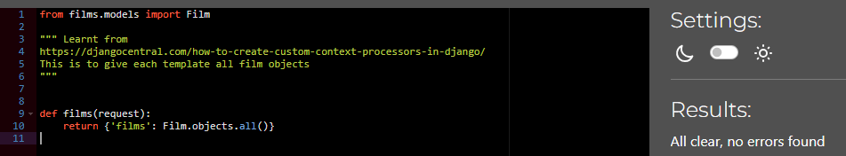
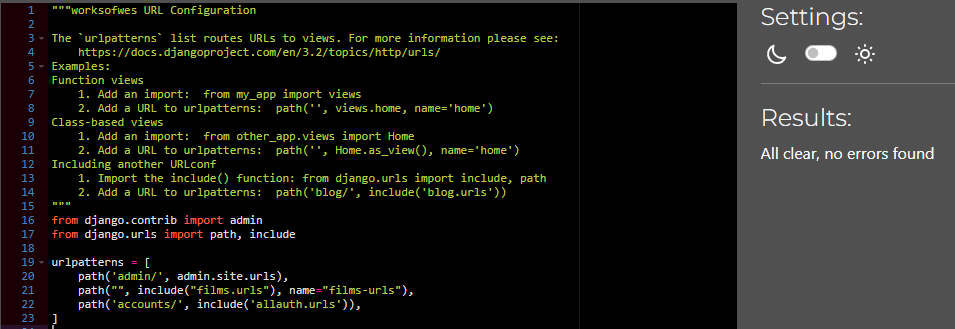
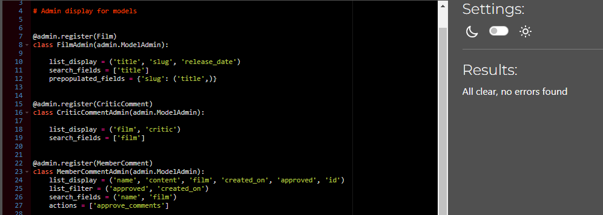
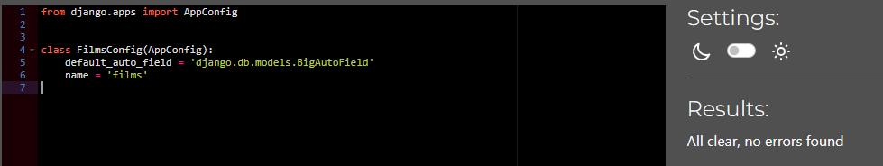
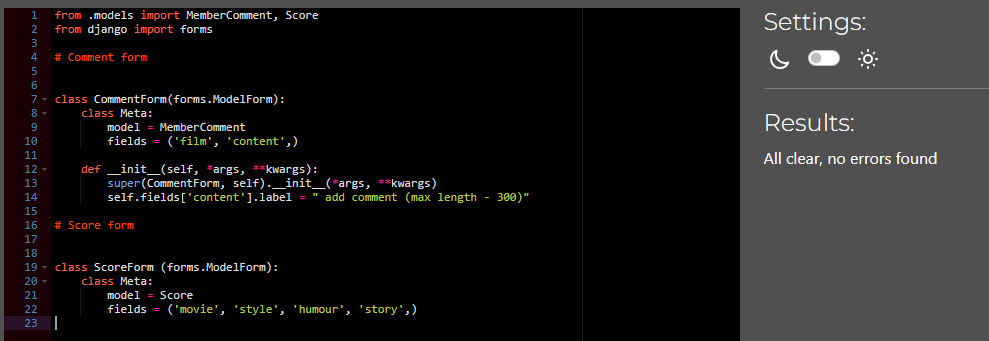
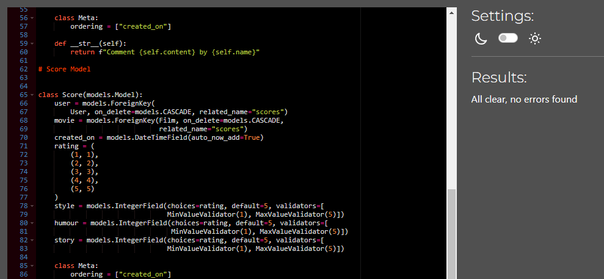
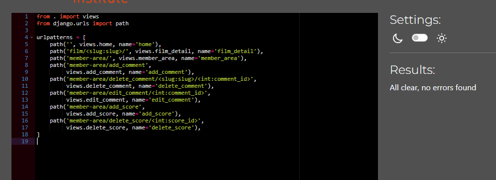
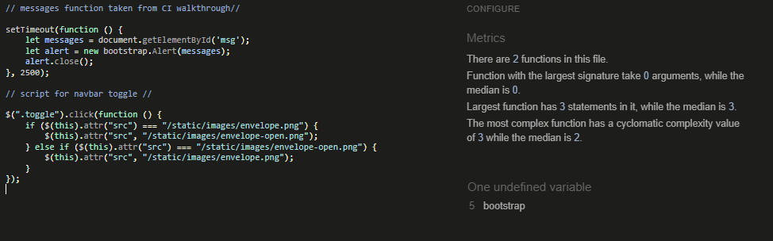
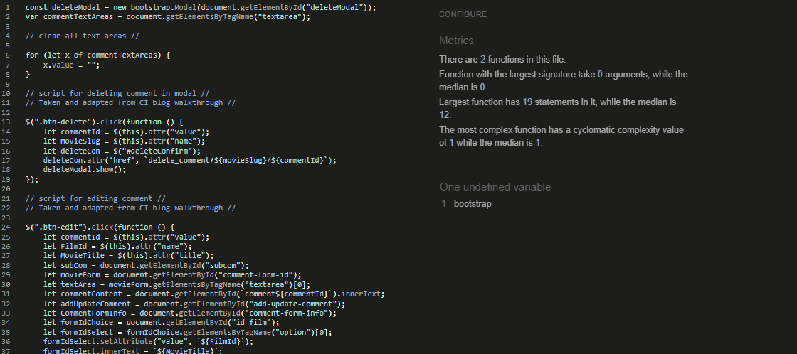
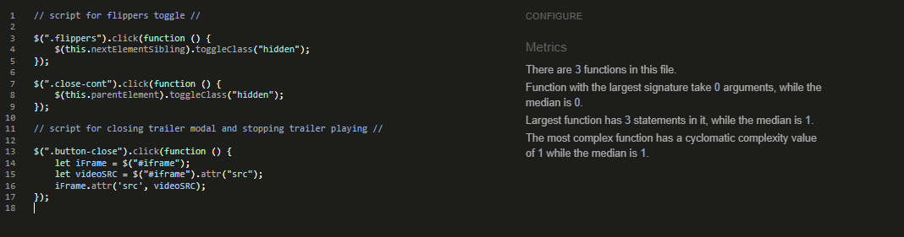

# CONTENTS

* [User Story Testing](#user-story-testing)
* [Device Responsiveness](#device-responsiveness)
* [Python Validator](#python-validator)
* [JavaScript Validator](#javascript-validator)
* [HTML Validator](#html-validator)
* [CSS Validator](#css-validator)
* [Lighthouse](#lighthouse)
* [Wave](#wave)
* [Manual Testing](#manual-testing)

## User Story Testing

## Device Responsiveness

### Problems/Bugs highlighted and how they were fixed

## Python Validator

[CI Python Linter](https://pep8ci.herokuapp.com/) was used to test the python code.  

The validation was done to all the custom python files written for this site. Settings.py was not included because it contains important data which is longer than 79 lines and can not be ajusted.  
No problems found, see results below.

### context_processors.py

Validator

### worksofwes urls.py

Validator

### admin.py

Validator

### apps.py

Validator

### forms.py

Validator

### models.py

Validator

### Films urls.py

Validator

### Films views.py

Validator

## JavaScript Validator  

[JS Hint](https://jshint.com/) was used to test the javascript code.

The validation was completed to all the javascript written for this site. Only the relevant javascript needed was linked to the template.  
The warnings given regarding an undefined variable "bootstrap", which is an external libary used.  
See the results blow.

### base.js

Validator

### comments.js

Validator

### film.js

Validator

## HTML Validator

### Problems/Bugs highlighted and how they were fixed  

### Final Test Results

## CSS Validator  

### Problems/Bugs highlighted and how they were fixed  

### Final Test Results

## Lighthouse  

### Problems/Bugs highlighted and how they were fixed  

### Final Test Results

## Wave  

### Problems/Bugs highlighted and how they were fixed

### Final Test Results

## Manual Testing
