# CONTENTS

* [User Story Testing](#user-story-testing)
* [Browser Support](#browser-testing)
* [Device Responsiveness](#device-responsiveness)
* [Python Validator](#python-validator)
* [JavaScript Validator](#javascript-validator)
* [HTML Validator](#html-validator)
* [CSS Validator](#css-validator)
* [Lighthouse](#lighthouse)
* [Wave](#wave)
* [Manual Testing](#manual-testing)
* [Other Bugs And Errors](#other-bugs-and-errors)

## User Story Testing  

### 15 Site Admin  

As Site Admin I am able to access the admin page so I can create, edit and delete relevant items

#### Acceptance Criteria

The admin page is visible when Admin is logged in

#### Results  

The acceptance criteria was met allowing site admin to easily view, create and edit all relevant items once logged in as admin and on the /admin url.

### 16 Home Page  

As a Site User I can see an About message on the landing page so I clearly know what to expect from the website.

#### Acceptance Criteria  

The about message is displayed on the Home/Landing page

#### Results  

The acceptance criteria was met allowing the user to view the about message on the home page. The message is clear and also provides a link to become a member or go to the member area depending on if the user is logged in or not.

### 17 Initial Navigation Bar  

As a Site User I can clearly see how to navigate the site so I can find what I'm looking for.

#### Acceptance Criteria

* The navigation bar is visible with all possible links
* The Logo and Home link to Home
* The Home link is active when on this page
* The Footer is at the bottom

#### Results  

All acceptance criteria was met. The navigation bar is clear and allows the user to easily navigate the website and letting them know what page is active. It is responsive to different devices with a hamburger toggle for smaller devices which works well and is clear.

### 18 Add Film Information  

As Site Admin I can create different Films profiles so the website can display their information

#### Acceptance Criteria

The ability for site Admin to create new Film objects on Admin site

#### Results

The Admin can easily add a new film whilst in the admin area.

### 19 View Films On About Page  

As a Site User I want to see all the Films on the about page so I know what films there are and can select one to see detail

#### Acceptance Criteria

You can see each film poster on the about page.

#### Results

Each film poster is clearly displayed on the about page for the user to see.

### 20 Film Detail Page  

As a Site User I would like to see a page for each film so I can see film information

#### Acceptance Criteria

* You can link to a URL for each film
* You can see Film details

#### Results

The user can navigate to each film detail page easily by pressing the link in the nav bar or on the poster in the about page. All the film details can be seen in the relevent film detail page.

### 21 Critic Comments  

As a Site User I want to see what the critics comments so I can have further information.

#### Acceptance Criteria

You can see all critic comments about each film

#### Results  

The user can view all critics comments on the relevent film detail page.

### 22 Member Registration  

As a Site User I can register as a member so I can interact with the site content.

#### Acceptance Criteria

A user can register an account.

#### Results

A User can easily register by going to the sign up area and creating an account. The registration form is clear, easy to use and understand. The registration link is only visible if the user is not logged in to make navigation clearer.

### 23 Log In and Log Out  

As a Site User I want to log in and out so I can interact with the site content.

#### Acceptance Criteria

A user can log in and log out

#### Results

A user can login and logout easliy when going to the relevent page. Only the relevent links are visible whether the user is already logged in or not.

### 24 View Member Comments  

As a Site User I would like to be able to view members comments so I can see peoples opinions/appreciation for the films.

#### Acceptance Criteria

All authorised member comments are displayed on each film detail

#### Results

Once a comment is authorised by admin it is visible in the relevant film detail area.

### 25 Member Area Page  

As a Logged in member I would like to have an area where I can see all my comments.

#### Acceptance Criteria

Be able to view a member area page where only logged in members can visit

#### Results

If the user is a member they can log in and go to the member area. This link is only visible to logged in members and is clear to navigate to.

### 26 Member Can Add Comment  

As a Logged in Member I would like to add comments for each film so that I can share my thoughts.

#### Acceptance Criteria

* Can add a comment for each film in the member area
* Get notified that comment is waiting for approval when added
* You can see waiting for approval comments in member area
* Comment added to database waiting for approval by admin

#### Results

All acceptance criteria is met. The process of adding a comment is clear with simple instruction and a straight forward form to fill in. Once a comment is added to the database a clear message is given to the user and the comment can be seen in the member area under the film the comment was made in. This comment is labeled with pending approval until the admin approves the comment.

### 27 Member Can Edit Comments  

As a Logged in Member I would like to edit my comments so I can amend mistakes and change my opinion.

#### Acceptance Criteria

* Can edit all comments
* Get notified that comment is waiting for approval when edited
* Comment in database edited
* You can see waiting for approval comments in member area

#### Results

All acceptance criteria is met. If the user presses the edit button the form scrolls into view, popultes correctly and changes instruction message. This all makes the process of editing the comment straight forward.

### 28 Member Can Delete Comments  

As a Logged in Member I would like to delete my comment if I want my comment removed.

#### Acceptance Criteria

* You can delete all comments
* You get asked if you are sure
* You see message confirming deletion
* Comment is no longer seen
* Comment gone from database

#### Results  

All acceptance criteria is met. Once the delete button is pressed all instructions are clear and functionality works well.

### 29 Member Can Rate File By Category  

As a Logged in Member I would like to rate each film by category to contribute to the sites content and share opinion.

#### Acceptance Criteria

* You can add score for Comedy, Style and Story for each film
* You can see added score in member area
* Message that score has been added
* Score added to database

#### Results  

All acceptance criteria is met. The form in the member area is easy to use and all functionality works well. The users score can be clearly seen in the relevant film section of the member area. Only one rating per film can be added and a message is given to the user if they try to add another.

### 30 Ability For Member To Delete Score  

As a Logged in Member I would like to be able to delete my score in case I change my mind.

#### Acceptance Criteria

* Can delete score
* User asked for confirmation
* User gets message confirming deletion
* Score deleted from database

#### Results

I decedided not to ask for confirmation after the delete button is pressed, I felt that this was not needed as it is easy to add another score and it makes for a smoother user experience. All the other acceptance criteria is met and works well.

### 31 View Average Scores  

As a Site User I would like to see average score for each category so I know other members opinions.

#### Acceptance Criteria

Can see average score for Comedy, Style and Story for each film in film_detail.html

#### Results  

The user can clearly see the average member ratings in the relevant film detail page, this number is rounded to the nearest whole number.

### 37 Favicon  

As a user I would like to easily identify the websites tab so I can access it quickly.

#### Acceptance Criteria

Favicon visible

#### Results

The favicon is clear to see and relevant to the website.

### 38 Error Pages  

As a Developer I would like the user to see custom error pages to provide good user experience.

#### Acceptance Criteria

* If an error occurs the relevant custom page is shown
* There is a link to the home page

#### Results  

There are error pages made for relevant errors with a link back to home page to ensure a good user experience.

## Browser Testing

The website was tested with Google Chrome, Microsoft Edge and Safari.  

There were no issuses with Google Chrome and Microsoft Edge.  

Issues and fixes for Safari:

Please note that I was only able to test the website on an IPad and not on a mac but hopefully most issues were highlighted and fixed.  

* A large design aspect for this website is using horizontal scoll containers for comments.  
   Sadly Safari do not allow custom scroll bars. This website uses unique colors for each film scroll bar but Safari do not recogise these. It does not overly effect the overall design but I made sure that the user knew that they had to scroll cross by adding the word scroll in the member area and making sure an overlap of the next scroll item was seen.  
* The footer icons appeard stretched so a fixed height was needed to fix the issue.
* The default colors for Safari and bootstrap seemed to fight . CSS was added to overide the problems. The main problem was in submit buttons where the text couldn't be seen because the default was white text so it was needed to be change to black to fix the issue.

## Device Responsiveness

Responsiveness was tested throughout the development by using dev tools on every section of the site.  
I focused on whether the site works on small devices of 300px wide and also the larger breakpoint of 1024px plus wide. This website is fully responsive on all devices.  
The use of bootstap responsive classes were used on most of the features to ensure responsivness but the odd media query was added when needed.  
As well as using [responsivedesignchecker.com](https://www.responsivedesignchecker.com
) on avaliable pages the reponsivness was tested on various mobile phones, laptop and an Ipad.  
Lots of adjustments throughtout development were made to ensure responsive design.  

## Python Validator

[CI Python Linter](https://pep8ci.herokuapp.com/) was used to test the python code.  

The validation was done to all the custom python files written for this site. Settings.py was not included because it contains important data which is longer than 79 lines and can not be ajusted.  
No problems found, see results below.

### context_processors.py

Validator

### worksofwes urls.py

Validator

### admin.py

Validator

### apps.py

Validator

### forms.py

Validator

### models.py

Validator

### Films urls.py

Validator

### Films views.py

Validator

## JavaScript Validator  

[JS Hint](https://jshint.com/) was used to test the javascript code.

The validation was completed on all the javascript written for this website. Only the relevant javascript needed is linked to the template that needs it.  
I wanted to try new learning in this project by using JQuery when I could but vanilla javascript was used too when needed. These functions work well but I am aware that the script could possibly be streamlined, this can be looked at at a future date.  
The warnings given are referencing an undefined variable "bootstrap", which is an external libary used.  
See the results functionality and manual testing below.

### base.js  

This comprises of two functions:  

* The first being to timeout the messages. I have manually tested this on all messages and it gives the required timeout result.
* The second function was made to add style to the bootstrap hamburger menu and change the hamburger to an envelope to open and close on click. Manually tested by pressing navbar toggle button and getting the required result.

Validator

### comments.js

This has three functions:

* The first one makes sure the text area on the form is clear once the page is loaded. Manually tested by visiting the member area after editing a comment and all text areas are empty.
* The second function is activated when the 'delete' button is pressed on any comment. It makes the 'delete confirm' button on the modal have the correct href with relevent comment id and slug. Manually tested by pressing the delete buttons, all above above expected outcomes met and works well.
* The last function is activated when the 'edit' button is pressed on any comment. It changes relevent text on the form, puts the form to the correct film value and gives the action the comment id so when the submit button is pressed it goes to the correct view. Manually tested by pressing the edits buttons, all above expected above outcomes met and works well.

Validator

### film.js

Here there are two functions:

* The toggle function hides and shows the film information or film poster when the relevent button is pressed. Manually tested by pressing the toggle button and all above expected outcomes met.
* The other function makes sure the youtube video stops playing when the close button on the modal is pressed. Manualy tested by playing trailer and closing, expected outcome of video stopping met.

Validator

## HTML Validator

### Problems/Bugs highlighted and how they were fixed  

* Trailing / on images - Removed to fix issues.
* Multi ID error on full-width-snap-container css ID - Changed to class to fix.
* 'Figurecaption' incorrectly used - Changed to resolve error.
* 'Div' element within 'button' - Changed to span fix error.
* 'frameboarder and aria-labeldby' not needed in iframe - Removed to fix error.
* Attribute 'comment-id' not avaliable for button element - Tis was changed to the attribute 'name'.

### Final Test Results

Home

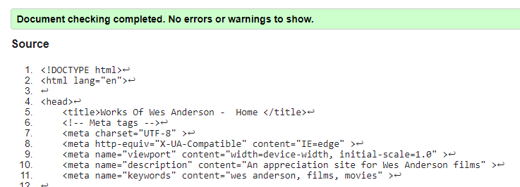

Film

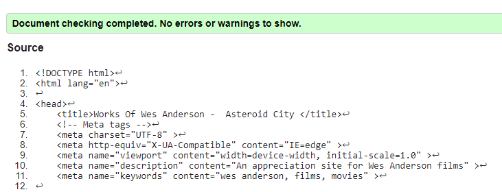

Member

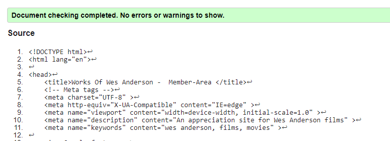

Error

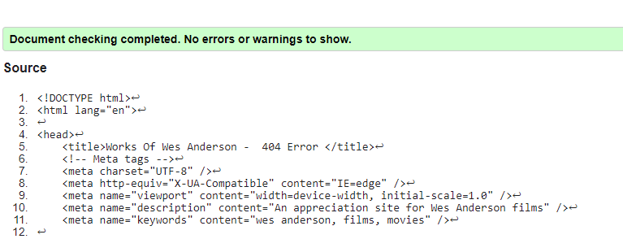

## CSS Validator  

Validator

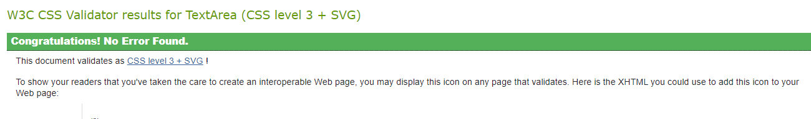

### Problems/Bugs highlighted and how they were fixed  

### Final Test Results

## Lighthouse  

### Problems/Bugs highlighted and how they were fixed  

* To improve the performance score each image height and width was added.
* Unnecessary aria labels were removed to improve accessibility scores.

### Final Test Results  

Below are the results of the desktop tests. The mobile results are the same but with lower performance scores due to the time the images take to render.  

Home

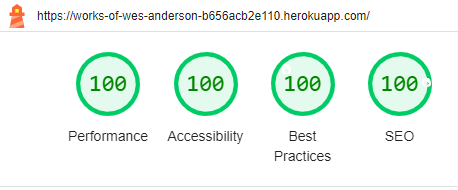

Film

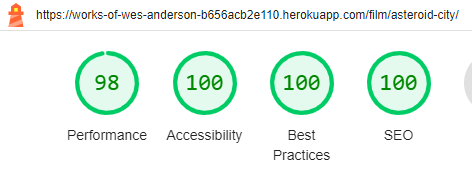

Member

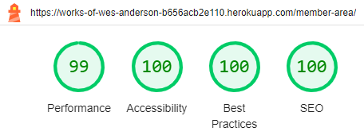

Login

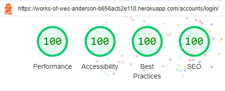

Logout

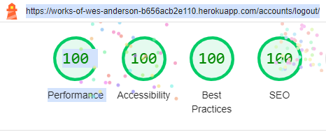

Register

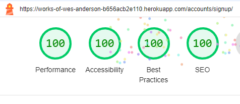

## Wave  

### Problems/Bugs highlighted and how they were fixed

* Wave suggested underlined text be removed to avoid confusion with link text.  
  Underlined text was removed as per suggestion.  
* The heading of the delete modal skipped the heading level so was altered to fix the issue.
* In the signup template a broken link was found to the login area- this was fixed.

### Final Test Results  

No errors found after final testing.  
There are alerts regarding Redundant links.  
I have considered removing the links mentioned but I have decided to keep them.  
I feel The Logo 'home' link is needed especially in mobile devices when the toggle nav is closed. Extra links to signing up/member-area were added to encourage the user becoming a member and showing the benifits of registering.  

Alert

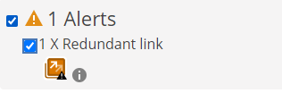

  

## Manual Testing  

## Other Bugs and Errors  

* Images added in the film model CloudinaryField produced an error found in dev tools console stating the image was HTTP instead of the prefered HTTPS.  
This automatically should have been converted to a HTTPS image acording to the cloudinary documention but was not.  
The fix was eventually found in the cloudinary documentation - 'cloudinary.convig secure=true' was added in settings.py which resolved the issue.  
* Once the trailer is played in the film detail page there is a console error due to the embeded Youtube video that can not be fixed at this time. It refers to "ensure CORS response header values are valid". I have researched this and the issue seems to be between Google and Youtube so I am unable to fix this error. This error does not effect the functionality of the site but I plan to research this error more at a future date. This error does not occur if I remove the Youtube iframe. The error can be found below.
  

CORS Error

  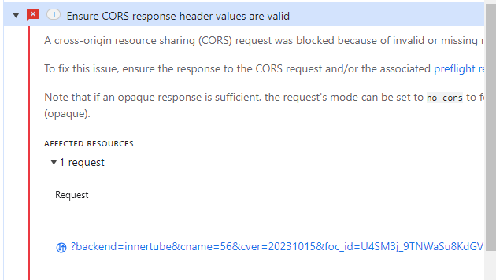
  

* Linked to the above issue, there are two issues in dev-tools relating to the embeded Youtube iframe form field in the film detail page. This seems to be an external issue with Youtube's iframe. I researched for a fix to this but I could not find one, I will re visit this in the future to see if there is a work around. This error does not occur if I remove the Youtube iframe.
  

Youtube Form

  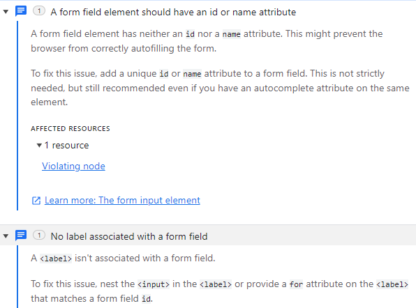
  

