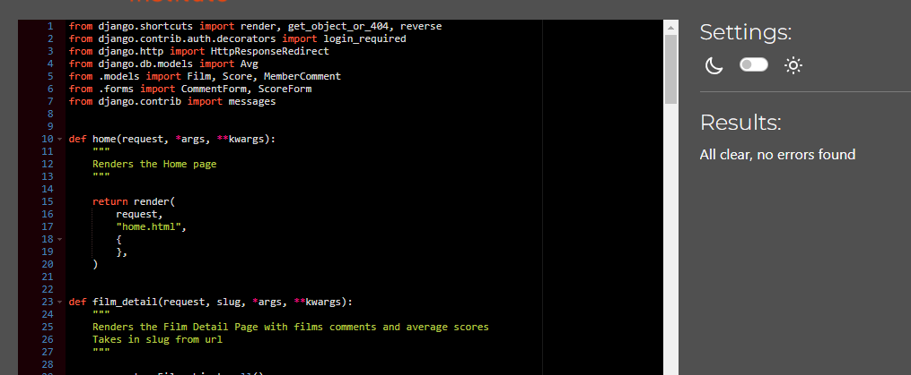

# CONTENTS

* [User Story Testing](#user-story-testing)
* [Device Responsiveness](#device-responsiveness)
* [Python Validator](#python-validator)
* [JavaScript Validator](#javascript-validator)
* [HTML Validator](#html-validator)
* [CSS Validator](#css-validator)
* [Lighthouse](#lighthouse)
* [Wave](#wave)
* [Manual Testing](#manual-testing)

## User Story Testing  

Here are the user stories tested.

### 15 Site Admin

#### Acceptance Criteria

The admin page is visible when Admin is logged in

#### Results

### 16 Home Page

#### Acceptance Criteria

The about message is displayed on the Home/Landing page

#### Results

### 17 Initial Navigation Bar

#### Acceptance Criteria

* The navigation bar is visible with all possible links
* The Logo and Home link to Home
* The Home link is active when on this page
* The Footer is at the bottom

#### Results

### 18 Add Film Information

#### Acceptance Criteria

The ability for site Admin to create new Film objects on Admin site

#### Results

### 19 View Films On About Page

#### Acceptance Criteria

You can see each film poster on the about page

#### Results

### 20 Film Detail Page

#### Acceptance Criteria

* You can link to a URL for each film
* You can see Film details

#### Results

### 21 Critic Comments

#### Acceptance Criteria

You can see all critic comments about each film

#### Results

### 22 Member Registration

#### Acceptance Criteria

A user can register an account

#### Results

### 23 Log In and Log Out

#### Acceptance Criteria

A user can log in and log out

#### Results

### 24 View Member Comments

#### Acceptance Criteria

All authorised member comments are displayed on each film detail

#### Results

### 25 Member Area Page

#### Acceptance Criteria

Be able to view a member area page where only logged in members can visit

#### Results

### 26 Member Can Add Comment

#### Acceptance Criteria

* Can add a comment for each film in the member area
* Get notified that comment is waiting for approval when added
* 8You can see waiting for approval comments in member area
* Comment added to database waiting for approval by admin

#### Results

### 27 Member Can Edit Comments

#### Acceptance Criteria

* Can edit all comments
* Get notified that comment is waiting for approval when edited
* Comment in database edited
* You can see waiting for approval comments in member area

#### Results

### 28 Member Can Delete Comments

#### Acceptance Criteria

* You can delete all comments
* You get asked if you are sure
* You see message confirming deletion
* Comment is no longer seen
* Comment gone from database

#### Results

### 29 Member Can Rate File By Category

#### Acceptance Criteria

* You can add score for Comedy, Style and Story for each film
* You can see added score in member area
* Message that score has been added
* Score added to database

#### Results

### 30 Ability For Member To Delete Score

#### Acceptance Criteria

* Can delete score
* User asked for confirmation
* User gets message confirming deletion
* Score deleted from database

#### Results

### 31 View Average Scores

#### Acceptance Criteria

Can see average score for Comedy, Style and Story for each film in film_detail.html

#### Results

### 37 Favicon

#### Acceptance Criteria

Favicon visible

#### Results

### 38 Error Pages

#### Acceptance Criteria

* If an error occurs the relevant custom page is shown
* There is a link to the home page

#### Results

## Device Responsiveness

### Problems/Bugs highlighted and how they were fixed

## Python Validator

[CI Python Linter](https://pep8ci.herokuapp.com/) was used to test the python code.  

The validation was done to all the custom python files written for this site. Settings.py was not included because it contains important data which is longer than 79 lines and can not be ajusted.  
No problems found, see results below.

### context_processors.py

Validator

### worksofwes urls.py

Validator

### admin.py

Validator

### apps.py

Validator

### forms.py

Validator

### models.py

Validator

### Films urls.py

Validator

### Films views.py

Validator

## JavaScript Validator  

[JS Hint](https://jshint.com/) was used to test the javascript code.

The validation was completed on all the javascript written for this website. Only the relevant javascript needed is linked to the template that needs it.  
I wanted to try new learning in this project by using JQuery when I could but vanilla javascript was used too when needed. These functions work well but I am aware that the script could possibly be streamlined, this can be looked at at a future date.  
The warnings given are referencing an undefined variable "bootstrap", which is an external libary used.  
See the results and manual testing below.

### base.js  

This comprises of two functions:  

* The first being to timeout the messages. I have manually tested this on all messages and it works well.
* The second function was made to add style to the bootstrap hamburger menu and change the hamburger to an envelope to open and close on click. I have manually tested this many times and it works well.

Validator

### comments.js

This has three functions:

* The first one makes sure the text area on the form is clear once the page is loaded. This has been manually tested and works well.
* The second function is activated when the 'delete' button is pressed on any comment. It makes the 'delete confirm' button on the modal have the correct href with relevent comment id and slug. This has been manually tested and works well.
* The last function is activated when the 'edit' button is pressed on any comment. It changes relevent text on the form, puts the form to the correct film value and gives the action the comment id so when the submit button is pressed it goes to the correct view. This has been manually tested and works well.

Validator

### film.js

Here there are two functions:

* The toggle function hides and shows the film information or film poster when the relevent button is pressed. This has been manually tested and works well.
* The other function makes sure the youtube video stops playing when the close button on the modal is pressed. This has also been tested manually and works well.

Validator

## HTML Validator

### Problems/Bugs highlighted and how they were fixed  

### Final Test Results

## CSS Validator  

### Problems/Bugs highlighted and how they were fixed  

### Final Test Results

## Lighthouse  

### Problems/Bugs highlighted and how they were fixed  

### Final Test Results

## Wave  

### Problems/Bugs highlighted and how they were fixed

### Final Test Results

## Manual Testing
